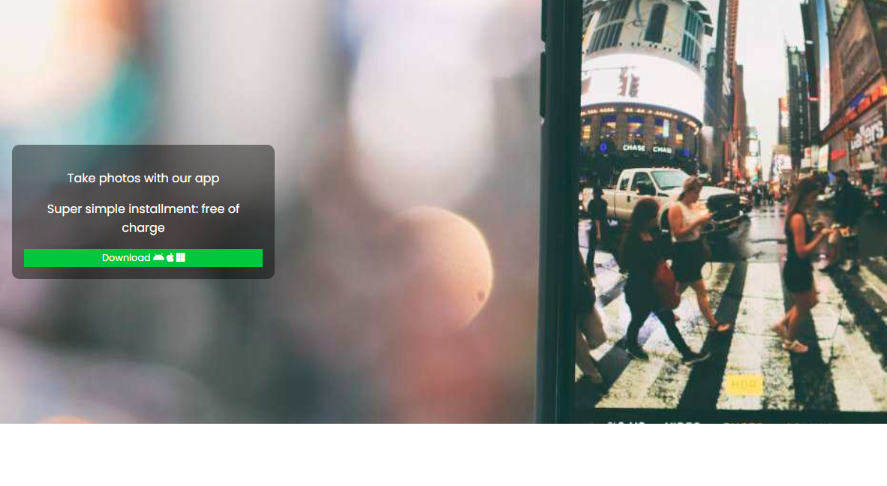

# Project Title

A brief description of what this project does and who it's for
  

-  first Item
 - second Item
```echo"hello world"```


## Screenshots




## Deployment

To deploy this project run

```bash
  npm run deploy
```


## Documentation

[Documentation](https://linktodocumentation)


## Features

- Light/dark mode toggle
- Live previews
- Fullscreen mode
- Cross platform


## Optimizations

What optimizations did you make in your code? E.g. refactors, performance improvements, accessibility


## Roadmap

- Additional browser support

- Add more integrations


## License

[MIT](https://choosealicense.com/licenses/mit/)

